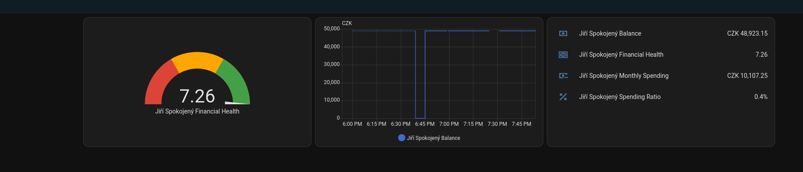

# Home Assistant ErsteGroup Integration



Custom integration for Home Assistant to track ErsteGroup (specifically developed for Česká Spořitelna, probably works
for others) banking accounts.

## Features

- Balance tracking
- Monthly spending calculation
- Spending/income ratio
- Financial health indicator (runway until payday)

## Getting the API keys

Go to the [ErsteGroup developer portal](https://developers.erstegroup.com/), create a new organization (without a DIC),
and a new project. Use OAuth2 (**set your redirect url to `https://example.com`, and 180 days until expiry**) and enable
the `Premium - Accounts API (v3)` API (free for natural persons' accounts,
otherwise
300CZK/month).

Add the integration into HA, fill out the required parameters, click the authentication step and paste the complete URL
after authentication into the text box.

If everything works correctly, apply for production access. For me this took about four business days.

## Installation

### HACS

1. Add this repository as a custom repository in HACS
2. Install "ErsteGroup Banking"
3. Restart Home Assistant

### Manual

1. Make a `custom_components` directory in your HA config directory
2. Run `git clone https://github.com/3top1a/homeassistant-erstegroup.git`
3. Restart Home Assistant

## Sensors

- `sensor.{account}_balance` - Current account balance
- `sensor.{account}_monthly_spending` - Current month spending (excluding internal transfers between accounts)
- `sensor.{account}_spending_ratio` - Last 30 days spending/income ratio
- `sensor.{account}_financial_health` - Safety margin, calculated as
  `days until money runs out at current burn rate / days until payday`

## Development

A few helpful commands

```bash
python -m script.hassfest --action=validate --integration-path homeassistant/components/erstegroup # Validate integration
python -m script.hassfest --action=generate # Register integration into HA
python -m script.translations develop --integration erstegroup # Generate translation

```

## License

MIT
